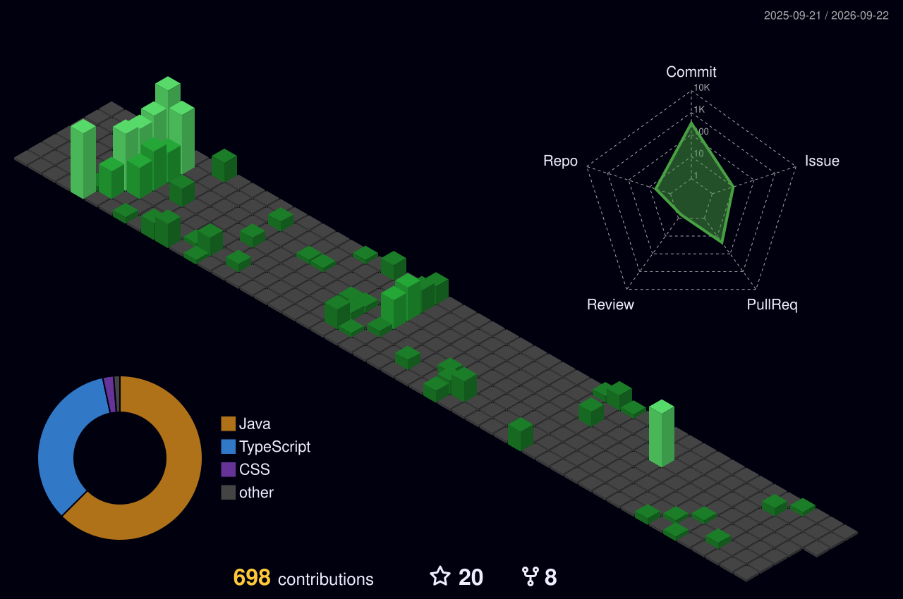

<h1 align="center">Hi, I'm Rohith 👋</h1>
<h3 align="center">Software Development Engineer | Full Stack & ML Enthusiast</h3>

I'm **J V L S Rohith**, a Software Development Engineer with **1 year of hands-on experience** building and shipping full-stack products and ML-driven tools. I care about clean architecture, fast iteration, and software that actually solves problems — not just demos well.

- 💼 **Currently:** Building & scaling production features across the stack at LTM as SDE
- 🧠 **Focus areas:** Full Stack Development, Machine Learning, Automation
- 🏗️ **Recently shipped:** [Code365](https://www.code365.tech), [Resume Builder](https://coderesume.netlify.app/), [PDF-to-Quiz](https://pdfto-quiz.vercel.app/)
- 🌱 **Currently sharpening:** System design, scalable backend architecture
- 🤝 **Open to:** Full-time SDE roles & impactful collaborations
- 📫 **Reach me:** [rohithjuluru2201@gmail.com](mailto:rohithjuluru2201@gmail.com)

## 🌐 Connect With Me

## 💻 Tech Stack

                                

## 🚀 Featured Projects

| Project | Description | Link |
|---|---|---|
| **Code365** | A platform engineered to help you maximize your DSA learning outcomes through structured, daily progress.| [code365.tech](https://www.code365.tech) |
| **Resume Builder** | Web app to generate polished, ATS-friendly resumes on the fly | [coderesume.netlify.app](https://coderesume.netlify.app/) |
| **PDF-to-Quiz** | Converts any PDF into an auto-generated quiz using ML/NLP | [pdfto-quiz.vercel.app](https://pdfto-quiz.vercel.app/) |

## 📊 GitHub Stats

  
  

  
  

  

  

  

  

<h2>Achivements</h2>
<h1>HacktoberFest</h1>
<h2>Holopin Badges<h2>

## ❤️ I Code On

---

## ✍️ Latest Blog Posts

<!-- BLOG-POST-LIST:START -->
- [Essential Strategies for Preventing Fraud](https://medium.com/@julururohith191020109/essential-strategies-for-preventing-fraud-00b96cb9c5e2?source=rss-6c76dbb08be5------2)
- [Engineering Code365 to Feel Like a Real Product](https://medium.com/@julururohith191020109/engineering-code365-to-feel-like-a-real-product-7392bc040e2a?source=rss-6c76dbb08be5------2)
- [10 AI Tools That Replace a Full Dev Team (Almost)](https://medium.com/@julururohith191020109/10-ai-tools-that-replace-a-full-dev-team-almost-adf12e3362e9?source=rss-6c76dbb08be5------2)
- [Automate Everything: How I Use n8n to Supercharge My Productivity with AI Agents](https://medium.com/@julururohith191020109/automate-everything-how-i-use-n8n-to-supercharge-my-productivity-with-ai-agents-065eafd87453?source=rss-6c76dbb08be5------2)
- [AI Agents: Revolutionizing the Future of Work and Interaction](https://medium.com/@julururohith191020109/ai-agents-revolutionizing-the-future-of-work-and-interaction-645c73fc34a3?source=rss-6c76dbb08be5------2)
<!-- BLOG-POST-LIST:END -->

  

