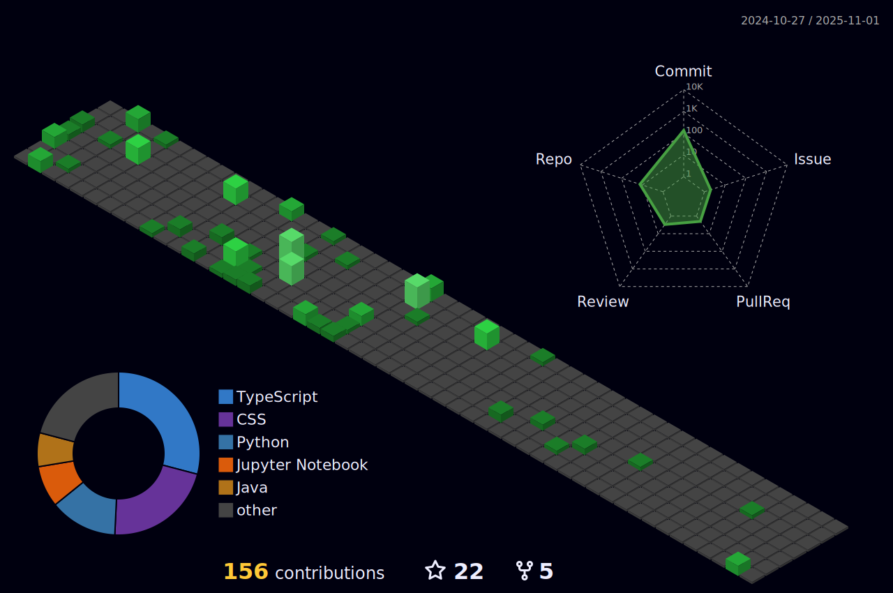

<h1 >Hi I'm ROHITH </h1></h1>

Hi, I'm J V L S ROHITH,I'm interested to work as a solution provider for Computer Software. Prefer in software development / Machine Learning / automation / programming field having good skill in projects & design developments. 

<ul>
<li> 🌱 I’m currently pursuing BTech in Computer Engineering at VIT-AP University </li>
<li>🔭 I’m currently Learning on FULL STACK DEVELOPMENT</li>
<li> 👯 I’m looking to collaborate on Full time projects on Machine Learning <li>💼 Wanna colab on Projects? do reach, <a href="mailto:rohithjuluru2201@gmail.com">email</a></li>
<li> 💬 Ask me about anything, I am happy to help </li>
<li> ⚡ Fun fact : The more you GRIND, the more you GET💫</li>
</ul>

## 🌐 Connect with me on:
       

# 💻 Tech Stack:
                                

# Recent Projects:
Code 365 : www.code365.tech 

Pdf-to-quiz : https://pdfto-quiz.vercel.app/

<h3 align="left">Connect with me:</h3>

  <h2>GITHUB TROPHIES</h2>
  

 
  
  
  
  

<h2>Achivements</h2>
<h1>HacktoberFest</h1>
<h2>Holopin Badges<h2>

<h1>Github Contribution✨<h1>

<h2>Rohith's Contribution Graph<h2>

 

## ❤️ I Code on Platforms

<a href="https://auth.geeksforgeeks.org/user/(<rohithjuluru2201>/profile)" target="blank">/profile)" height="30" width="40" /></a>

## 3D Contribution Calendar 📅 ..
 

 
  
  
  
  

  ### ✍️ Dev Quote

### MEDIUM Blogs posts

<!-- BLOG-POST-LIST:START -->
- [Grok-3: xAI’s Next Leap in AI Evolution](https://medium.com/@julururohith191020109/grok-3-xais-next-leap-in-ai-evolution-5aa91e4659f8?source=rss-6c76dbb08be5------2)
- [DeepSeek: The AI Revolution Disrupting the Market](https://medium.com/@julururohith191020109/deepseek-the-ai-revolution-disrupting-the-market-8e90b9905938?source=rss-6c76dbb08be5------2)
- [My Interview Experience with Deloitte US-India Offices](https://medium.com/@julururohith191020109/my-interview-experience-with-deloitte-us-india-offices-5ce4993bb384?source=rss-6c76dbb08be5------2)
- [My Recruitment Journey with LTI Mindtree](https://medium.com/@julururohith191020109/my-recruitment-journey-with-lti-mindtree-0c9914df65a5?source=rss-6c76dbb08be5------2)
- [The Metaverse: Redefining Digital Interaction](https://medium.com/@julururohith191020109/the-metaverse-redefining-digital-interaction-05f6f5cc7967?source=rss-6c76dbb08be5------2)
<!-- BLOG-POST-LIST:END -->

<!-- BLOG-POST-LIST:START -->
<!-- BLOG-POST-LIST:END -->

